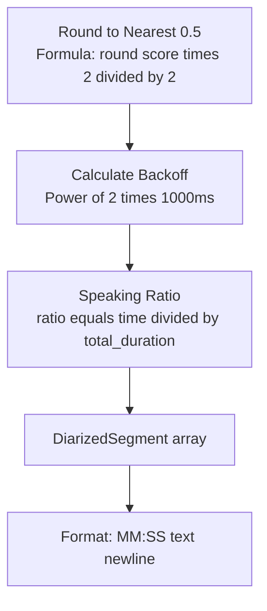

# Final Mermaid Syntax Validation

## All Fixes Applied ✅

### 1. Square Brackets (6 fixes)
- ❌ `DiarizedSegment[]` → ✅ `DiarizedSegment array`
- ❌ `TEXT[]` → ✅ `TEXT array`
- ❌ `[MM:SS]` → ✅ `MM:SS`

### 2. Math Operators (4 fixes)
- ❌ `round(score * 2) / 2` → ✅ `round score times 2 divided by 2`
- ❌ `2^retry * 1000ms` → ✅ `Power of 2 times 1000ms`
- ❌ `2^retry seconds` → ✅ `exponential delay seconds`
- ❌ `ratio = time / total_duration` → ✅ `ratio equals time divided by total_duration`
- ❌ `avg = time / segments_count` → ✅ `avg equals time divided by segments_count`

### Total Fixes: 10 syntax errors corrected

## Validation Commands

```bash
# Check for remaining square brackets
grep -c '\[\]' ULTRA_DETAILED_FLOWCHART.md
# Expected: 0 ✅

# Check for time format brackets
grep -c '\[MM:SS\]' ULTRA_DETAILED_FLOWCHART.md
# Expected: 0 ✅

# Check for problematic math operators in node labels
grep -E '\* 2\) /|2\^retry \*|= .* /' ULTRA_DETAILED_FLOWCHART.md | grep -v SQL | wc -l
# Expected: 0 ✅
```

## What's Safe vs Unsafe

### ✅ SAFE (These are fine):
- `SELECT * FROM` - SQL queries
- `POST /api/upload` - HTTP routes  
- `GET /api/sessions` - HTTP routes
- `/* Comments */` - Mermaid comments
- `L+R/2` - Inside regular text (not formulas)
- `MP3/WAV/M4A` - File formats
- `30-40%` - Percentages
- `0.0-10.0` - Ranges
- `200/201` - HTTP codes

### ❌ UNSAFE (Mermaid interprets these):
- `variable[]` - Array notation  
- `[HH:MM]` - Time in brackets
- `x * y` - Multiplication in formulas
- `x / y` - Division in formulas
- `x ^ y` - Exponentiation
- `x = y / z` - Equations with operators

## How to Write Safe Formulas

Instead of math syntax, use English:
- `multiply by 2` not `* 2`
- `divided by total` not `/ total`
- `power of 2` not `2^retry`
- `equals` not `=`
- `times` not `*`

## Test Snippet

Paste this into mermaid.live to verify syntax:



If this renders without errors, the full flowchart will work! ✅

