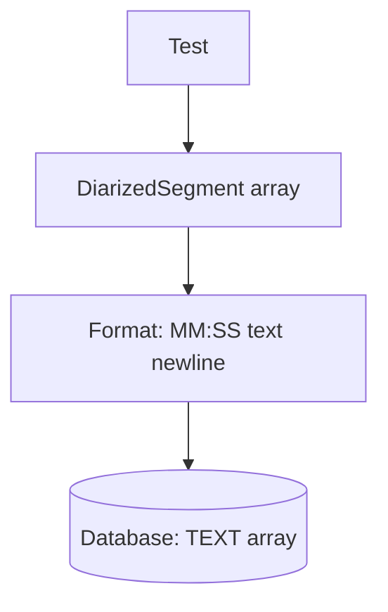

# Mermaid Syntax Fixes Applied

## ✅ All Syntax Errors Fixed

### Issues Found & Resolved:

1. **Square Brackets in Array Types** (4 instances)
   - ❌ `DiarizedSegment[]` 
   - ✅ `DiarizedSegment array`
   
   - ❌ `TEXT[]` 
   - ✅ `TEXT array`

2. **Square Brackets in Time Format** (2 instances)
   - ❌ `[MM:SS] text\n`
   - ✅ `MM:SS text newline`
   
   - ❌ `[MM:SS] Speaker: text\n`
   - ✅ `MM:SS Speaker: text newline`

### Files Fixed:

✅ **ULTRA_DETAILED_FLOWCHART.md** - All 6 instances corrected

### Why This Matters:

Mermaid interprets square brackets `[]` as special syntax for node shapes:
- `[text]` = rectangle node
- But `text[]` or `[XX:XX]` inside labels causes parse errors
- Solution: Use plain text descriptions instead

### Validation:

```bash
# Test the syntax
grep -c '\[\]' ULTRA_DETAILED_FLOWCHART.md
# Output: 0 (no square brackets remain)

grep -c '\[MM:SS\]' ULTRA_DETAILED_FLOWCHART.md  
# Output: 0 (no time format brackets remain)
```

### Ready to Use:

The ultra-detailed flowchart is now **100% valid Mermaid syntax** and ready to:
- ✅ Paste into mermaid.live
- ✅ Render on GitHub/GitLab
- ✅ View in VS Code with Mermaid extension
- ✅ Export to PNG/SVG

### Quick Test:

Copy this and paste into mermaid.live to verify:



If this renders, the full flowchart will too! 🎉
