# TherapyBridge Complete Algorithm Pipeline Flowchart

**Created:** 2025-12-23
**Version:** 1.0
**Purpose:** Visual documentation of the entire TherapyBridge system from audio upload through AI analysis

---

## How to View This Flowchart

This document contains Mermaid diagram syntax. To view the rendered flowchart:

1. **GitHub/GitLab:** View this file directly - Mermaid renders automatically
2. **VS Code:** Install "Markdown Preview Mermaid Support" extension
3. **Online:** Copy the code blocks to https://mermaid.live
4. **CLI:** Use `mmdc` (Mermaid CLI) to generate PNG/SVG

---

## Complete System Architecture

```mermaid
graph TB
    START([👤 User Uploads Audio]) --> FRONTEND[🌐 Frontend: Next.js 16]
    FRONTEND --> STORAGE{☁️ Supabase Storage}
    STORAGE --> DB[(🗄️ PostgreSQL Database)]
    DB --> PIPELINE[⚙️ Audio Pipeline]
    PIPELINE --> AI[🤖 AI Analysis Engine]
    AI --> RESULTS[📊 Dashboard Display]
    RESULTS --> USER([👤 User Views Results])

    style START fill:#4CAF50
    style USER fill:#4CAF50
    style FRONTEND fill:#2196F3
    style STORAGE fill:#FF9800
    style DB fill:#9C27B0
    style PIPELINE fill:#F44336
    style AI fill:#00BCD4
    style RESULTS fill:#4CAF50
```



---

## Phase 1: Audio Upload & Storage

```mermaid
flowchart LR
    A[📱 User Selects Audio File] --> B[📤 Upload to Supabase Storage]
    B --> C{✅ Upload Success?}
    C -->|Yes| D[💾 Create Session Record]
    C -->|No| E[❌ Show Error & Retry]
    E --> B
    D --> F[🔗 Link Audio URL to Session]
    F --> G[✨ Trigger Processing Pipeline]

    style A fill:#E3F2FD
    style D fill:#C8E6C9
    style E fill:#FFCDD2
    style G fill:#FFF9C4
```



**Database State After Upload:**
```
therapy_sessions:
  id: "uuid-123"
  audio_file_url: "https://..."
  processing_status: "pending"
  processing_progress: 0
```

---

## Phase 2: Audio Transcription Pipeline

```mermaid
flowchart TB
    START[🎵 Audio File] --> DOWNLOAD[📥 Download from Storage]
    DOWNLOAD --> PREPROCESS[🔧 Audio Preprocessing]

    subgraph PREPROCESS_STEPS[" "]
        P1[✂️ Trim Silence] --> P2[🔊 Normalize Volume]
        P2 --> P3[🎚️ Convert to 16kHz Mono MP3]
        P3 --> P4{📏 Size < 25MB?}
        P4 -->|Yes| P5[✅ Ready]
        P4 -->|No| P6[❌ File Too Large]
    end

    PREPROCESS --> P1
    P5 --> PARALLEL{⚡ Parallel Processing}

    PARALLEL --> WHISPER[🗣️ Whisper API Transcription]
    PARALLEL --> DIARIZE[👥 Pyannote Speaker Diarization]

    WHISPER --> MERGE[🔀 Merge Results]
    DIARIZE --> MERGE

    MERGE --> ROLES[🏷️ Detect Speaker Roles]
    ROLES --> TRANSCRIPT[📝 Final Transcript with Roles]

    style START fill:#E1F5FE
    style PREPROCESS fill:#F3E5F5
    style WHISPER fill:#FFF3E0
    style DIARIZE fill:#FFF3E0
    style MERGE fill:#E8F5E9
    style TRANSCRIPT fill:#C8E6C9
```



**Transcript Format:**
```json
[
  {
    "start": 0.0,
    "end": 3.5,
    "speaker": "Therapist",
    "text": "Hello, how are you feeling today?"
  },
  {
    "start": 3.6,
    "end": 8.2,
    "speaker": "Client",
    "text": "I've been struggling with anxiety this week."
  }
]
```

---

## Phase 3: Multi-Wave AI Analysis

```mermaid
flowchart TB
    TRANSCRIPT[📝 Complete Transcript] --> ORCHESTRATOR[🎯 Analysis Orchestrator]

    ORCHESTRATOR --> WAVE1{🌊 WAVE 1: Parallel Analysis}

    subgraph WAVE1_ANALYSES[" "]
        direction TB
        MOOD[😊 Mood Analysis<br/>GPT-5-nano]
        TOPICS[📋 Topic Extraction<br/>GPT-5-mini]
        BREAKTHROUGH[💡 Breakthrough Detection<br/>GPT-5]
    end

    WAVE1 --> MOOD
    WAVE1 --> TOPICS
    WAVE1 --> BREAKTHROUGH

    MOOD --> CHECK{✔️ All Wave 1<br/>Complete?}
    TOPICS --> CHECK
    BREAKTHROUGH --> CHECK

    CHECK -->|Yes| WAVE2[🧠 WAVE 2: Deep Analysis<br/>GPT-4o]
    CHECK -->|No| RETRY[🔄 Retry Failed Analyses]
    RETRY --> WAVE1

    WAVE2 --> COMPLETE[✅ Analysis Complete]

    style TRANSCRIPT fill:#E8F5E9
    style ORCHESTRATOR fill:#B3E5FC
    style MOOD fill:#FFECB3
    style TOPICS fill:#FFECB3
    style BREAKTHROUGH fill:#FFECB3
    style WAVE2 fill:#D1C4E9
    style COMPLETE fill:#C8E6C9
```



---

## Wave 1 Detailed Breakdown

### Mood Analysis Flow

```mermaid
flowchart LR
    A[📝 Full Transcript] --> B[🔍 Extract Patient Dialogue<br/>SPEAKER_01 only]
    B --> C[🤖 GPT-5-nano API Call]
    C --> D[📊 Parse Response]
    D --> E{✅ Valid Score?}
    E -->|Yes| F[💾 Store Mood Data]
    E -->|No| G[🔄 Retry]
    G --> C

    F --> RESULT[📈 Mood Score: 0.0-10.0<br/>Confidence: 0-1<br/>Rationale<br/>Key Indicators]

    style A fill:#E8F5E9
    style C fill:#FFECB3
    style F fill:#C8E6C9
    style RESULT fill:#BBDEFB
```



**Output Example:**
```
Mood Score: 4.5
Confidence: 0.85
Rationale: "Patient reports passive suicidal ideation,
          disrupted sleep, anhedonia, but reached out
          for help (positive protective factor)"
Key Indicators:
  • Passive suicidal ideation present
  • Severe sleep disruption (12 hours/day)
  • Complete anhedonia (can't open laptop)
  • Recent relationship loss
  • Reached out for help (positive factor)
```

---

### Topic Extraction Flow

```mermaid
flowchart LR
    A[📝 Full Transcript<br/>Therapist + Client] --> B[🤖 GPT-5-mini API Call]
    B --> C[📋 Parse Response]
    C --> D[🔍 Validate Technique<br/>Against Library]
    D --> E[✂️ Truncate Summary<br/>≤150 chars]
    E --> F[💾 Store Topics Data]

    F --> RESULT[📊 Topics 1-2<br/>Action Items 2<br/>Technique<br/>Summary]

    style A fill:#E8F5E9
    style B fill:#FFECB3
    style D fill:#FFF9C4
    style F fill:#C8E6C9
    style RESULT fill:#BBDEFB
```



**Output Example:**
```
Topics:
  • ADHD medication adjustment
  • Executive function strategies

Action Items:
  • Schedule psychiatrist appointment
  • Try body doubling technique this week

Technique: CBT - Cognitive Restructuring

Summary: "Patient exploring ADHD diagnosis. Discussed
         medication options and executive function tools."
```

---

### Breakthrough Detection Flow

```mermaid
flowchart LR
    A[📝 Full Transcript] --> B[🔀 Group by Speaker Turns]
    B --> C[🤖 GPT-5 API Call<br/>Ultra-Strict Criteria]
    C --> D[🔍 Parse Response]
    D --> E{💡 Breakthrough<br/>Found?}
    E -->|Yes| F{📊 Confidence<br/>≥ 0.8?}
    E -->|No| G[💾 Store: No Breakthrough]
    F -->|Yes| H[💾 Store Breakthrough Data]
    F -->|No| G

    H --> RESULT[✨ Breakthrough Label<br/>Description<br/>Evidence<br/>Timestamp]

    style A fill:#E8F5E9
    style C fill:#FFECB3
    style H fill:#C8E6C9
    style RESULT fill:#BBDEFB
    style G fill:#FFCDD2
```



**What IS a Breakthrough:**
- ✅ Root cause discovery (e.g., "My ADHD causes my depression, not laziness")
- ✅ Pattern recognition (e.g., "My anxious attachment mirrors my childhood")
- ✅ Identity insight (e.g., "I'm not broken, I'm neurodivergent")
- ✅ Reframe revelation (e.g., "My forgetfulness is ADHD, not failure")

**What is NOT a Breakthrough:**
- ❌ Emotional releases (crying, expressing feelings)
- ❌ Routine CBT work (identifying triggers)
- ❌ Skill application (using DBT skills)
- ❌ Progress updates (feeling better)
- ❌ Values clarification (deciding what matters)
- ❌ External realizations (about others, not self)

---

## Wave 2: Deep Analysis Flow

```mermaid
flowchart TB
    START[🌊 Wave 1 Complete] --> GATHER[📚 Gather Context]

    subgraph CONTEXT[" "]
        C1[😊 Mood History<br/>Last 10 sessions]
        C2[📋 Topic Patterns<br/>Frequency analysis]
        C3[💡 Breakthrough Timeline]
        C4[🛠️ Technique Usage History]
        C5[📊 Session Consistency Metrics]
    end

    GATHER --> C1
    GATHER --> C2
    GATHER --> C3
    GATHER --> C4
    GATHER --> C5

    C1 --> SYNTHESIZE[🧠 GPT-4o Synthesis]
    C2 --> SYNTHESIZE
    C3 --> SYNTHESIZE
    C4 --> SYNTHESIZE
    C5 --> SYNTHESIZE

    SYNTHESIZE --> PARSE[📊 Parse Deep Analysis]
    PARSE --> STORE[💾 Store Results]

    STORE --> RESULT[📈 Progress Assessment<br/>Clinical Insights<br/>Skills Learned<br/>Recommendations]

    style START fill:#E8F5E9
    style SYNTHESIZE fill:#D1C4E9
    style STORE fill:#C8E6C9
    style RESULT fill:#BBDEFB
```



**Output Example:**
```
Progress Assessment:
  "Patient showing consistent mood improvement over
   the past 6 weeks. ADHD diagnosis has significantly
   reduced self-blame and increased self-compassion."

Clinical Insights:
  • ADHD diagnosis was transformative breakthrough
  • Building executive function skills systematically
  • Medication titration proceeding well

Skills Learned:
  • Body doubling for focus
  • External memory systems (calendar, reminders)
  • Self-compassion reframing

Recommendations:
  • Continue medication adjustment with psychiatrist
  • Introduce time-blocking strategies next session
  • Consider ADHD coaching referral
```

---

## Phase 4: Frontend Display & User Interaction

```mermaid
flowchart LR
    COMPLETE[✅ Analysis Complete] --> POLL[🔄 Frontend Polls Status<br/>Every 2 seconds]
    POLL --> CHECK{📊 Status =<br/>complete?}
    CHECK -->|No| WAIT[⏱️ Wait 2s]
    WAIT --> POLL
    CHECK -->|Yes| REFRESH[🔄 Refresh Dashboard]

    REFRESH --> CARDS{📱 Update Components}

    CARDS --> C1[📋 SessionCard<br/>Topics, Mood, Summary]
    CARDS --> C2[📈 ProgressPatternsCard<br/>Mood Trend Chart]
    CARDS --> C3[📝 NotesGoalsCard<br/>Action Items]
    CARDS --> C4[💡 TherapistBridgeCard<br/>Breakthrough Display]

    C1 --> USER([👤 User Views Results])
    C2 --> USER
    C3 --> USER
    C4 --> USER

    style COMPLETE fill:#C8E6C9
    style REFRESH fill:#B3E5FC
    style C1 fill:#E1F5FE
    style C2 fill:#E1F5FE
    style C3 fill:#E1F5FE
    style C4 fill:#E1F5FE
    style USER fill:#4CAF50
```



---

## Error Handling & Retry Logic

```mermaid
flowchart TB
    START[⚡ API Call] --> ATTEMPT{🔄 Attempt Call}
    ATTEMPT --> SUCCESS{✅ Success?}

    SUCCESS -->|Yes| DONE[✅ Complete]
    SUCCESS -->|No| ERROR{❌ Error Type?}

    ERROR -->|Rate Limit 429| BACKOFF[⏱️ Exponential Backoff<br/>1s → 2s → 4s → 8s]
    ERROR -->|Server Error 5xx| BACKOFF
    ERROR -->|Network Error| BACKOFF
    ERROR -->|Timeout| BACKOFF
    ERROR -->|Client Error 4xx| FAIL[❌ Permanent Failure]

    BACKOFF --> RETRY{🔢 Retries < Max?}
    RETRY -->|Yes| ATTEMPT
    RETRY -->|No| FAIL

    FAIL --> LOG[📝 Log Error]
    LOG --> NOTIFY[🔔 Notify User]

    style START fill:#E3F2FD
    style DONE fill:#C8E6C9
    style FAIL fill:#FFCDD2
    style BACKOFF fill:#FFF9C4
```



**Retry Configuration:**
- **Max Retries:** 3-5 attempts (varies by service)
- **Backoff:** Exponential (2^attempt seconds)
- **Timeout:** 30s-300s (varies by operation)
- **Total Max Time:** 10 minutes per pipeline

---

## Database State Transitions


---

## Performance Metrics & Timing


**Total Average Time:** 3-5 minutes for complete pipeline

---

## Cost Breakdown (Per Session)


**Total Cost per Session:** ~$0.07 (excluding audio transcription)

---

## Key Design Decisions

### 1. **Why Parallel Wave 1?**
- Mood, Topics, and Breakthrough analyses are independent
- Running in parallel reduces total time by 60%
- No data dependencies between these analyses

### 2. **Why Sequential Wave 2?**
- Deep analysis REQUIRES Wave 1 results as input
- Synthesizes mood trends + topic patterns + breakthroughs
- Cannot start until all Wave 1 analyses complete

### 3. **Why Multiple AI Models?**
- **GPT-5-nano (Mood):** Fast, cheap, sufficient for structured analysis
- **GPT-5-mini (Topics):** Balanced for extraction + validation
- **GPT-5 (Breakthrough):** Highest reasoning for complex detection
- **GPT-4o (Deep):** Best synthesis of multiple data sources

### 4. **Why Supabase?**
- PostgreSQL with built-in authentication (RLS)
- Real-time subscriptions for live updates
- Storage for audio files
- Cost-effective for startups

### 5. **Why Pyannote over Whisper Diarization?**
- More accurate speaker separation
- Better handling of overlapping speech
- State-of-the-art research model (3.1)

---

## Viewing This Flowchart

### Option 1: GitHub/GitLab (Automatic)
Push this file to your repo and view it directly - Mermaid renders automatically.

### Option 2: VS Code (Extension)
1. Install "Markdown Preview Mermaid Support" extension
2. Open this file
3. Press `Cmd+Shift+V` (Mac) or `Ctrl+Shift+V` (Windows) to preview

### Option 3: Online Viewer
1. Go to https://mermaid.live
2. Copy any Mermaid code block from this file
3. Paste into the editor
4. Export as PNG/SVG

### Option 4: Generate Images (CLI)
```bash
# Install Mermaid CLI
npm install -g @mermaid-js/mermaid-cli

# Generate PNG from this file
mmdc -i THERAPYBRIDGE_ALGORITHM_FLOWCHART.md -o flowchart.png
```

---

**Maintained by:** TherapyBridge Development Team
**Last Updated:** 2025-12-23
**Version:** 1.0
