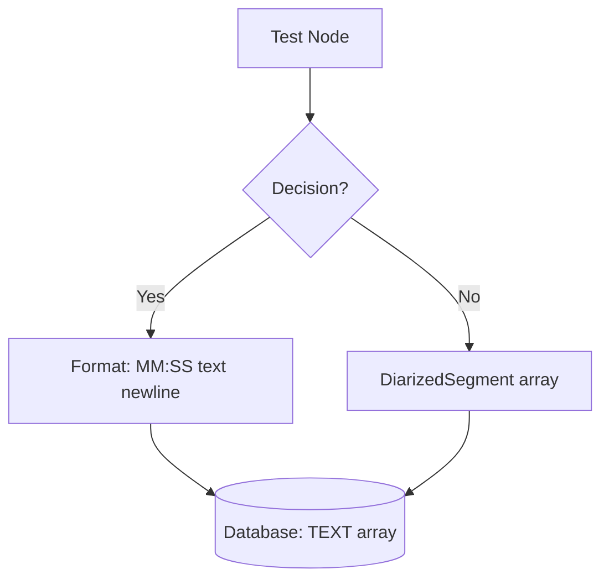

# Mermaid Syntax Test

```mermaid
flowchart TB
    A[Test Node] --> B{Decision?}
    B -->|Yes| C[Format: MM:SS text newline]
    B -->|No| D[DiarizedSegment array]
    C --> E[(Database: TEXT array)]
    D --> E
```

This should render without errors if the syntax is valid.
